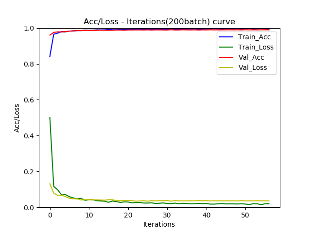

# CNN_Numpy
# CNN Inplementation from Scratch with Numpy

## Requirements
`Python >= 3.6, Numpy`

## Model Architecture
Choose the Classification Problem on MINIST to verify whether the code is correct, the Simple Model is as follows:

The project also provides some improvement references to improve the performance and efficiency of the model, such as GlobalPooling and Model Compression(MobileNet).For details, please refer to the code.

## Performance on MINIST

| version      | train_acc | validation_acc | inferencetime(ms/pf) |
| :----------- | :------------: | :-------: | :------------------: |
| **CNN** |    **99.10%**      |  **98.89%**     |       5(ms/pf)       |
| **MobileNet_CNN** |     98.79%     |  98.61%   |       **2(ms/pf)**  |
| **GlobalMAX_CNN** |     98.31%     |  97.68%   |       4(ms/pf)  |
| **GlobalAVG_CNN** |     93.07%     |  92.15%   |       4(ms/pf)  |

